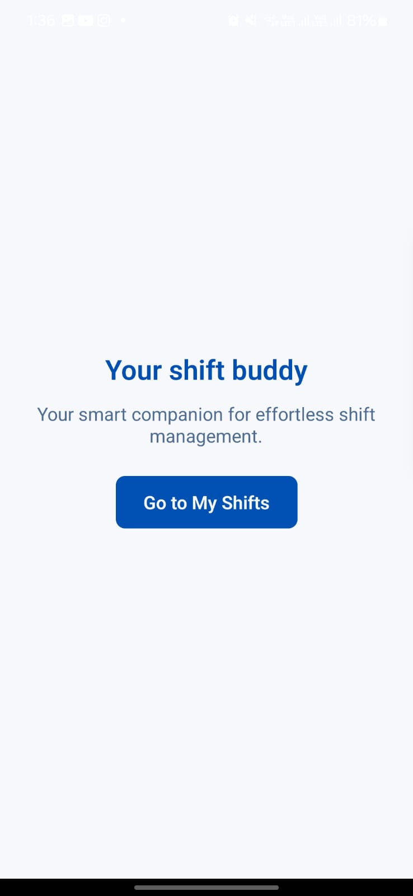
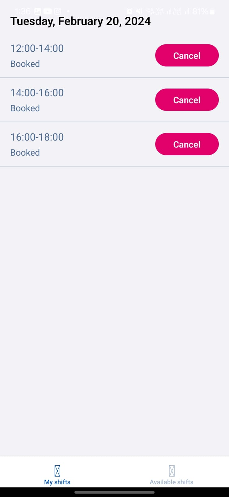
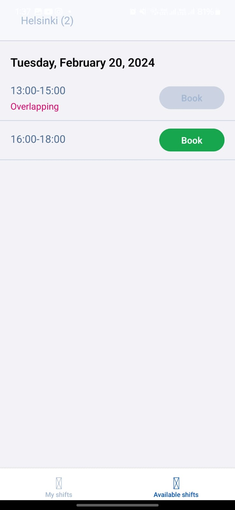

# 📆 Shift Booking App

A mobile Shift Booking App built using **React Native**, **Expo**, and **TypeScript**. This app allows users to view available time slots and book them with ease, all through a sleek and intuitive UI.

🔗 **GitHub Repository**: [Shift Booking App](https://github.com/shibadityadeb/Shift-Booking-app)

---

## 🖼️ Screenshots

| Landing Page | Booking Portal | Booking Confirmation |
|--------------|----------------|-----------------------|
|  |  |  |

---

## 🚀 Features

- 📲 Built with **React Native + Expo + TypeScript**
- 📅 Slot selection system with a clean interface
- ✅ Real-time slot booking experience (no backend)
- 🧭 Smooth and responsive navigation

---

## 🛠️ Tech Stack

- React Native (with Expo)
- TypeScript
- React Navigation

---

## ⚙️ Installation & Running Locally

```bash
# 1. Clone the repository
git clone https://github.com/shibadityadeb/Shift-Booking-app.git
cd Shift-Booking-app

# 2. Install dependencies
npm install

# 3. Start the Expo development server
npx expo start
